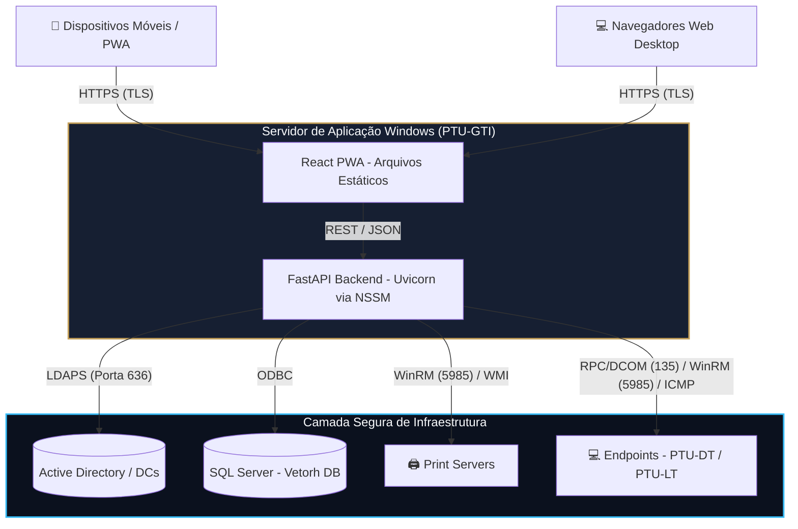
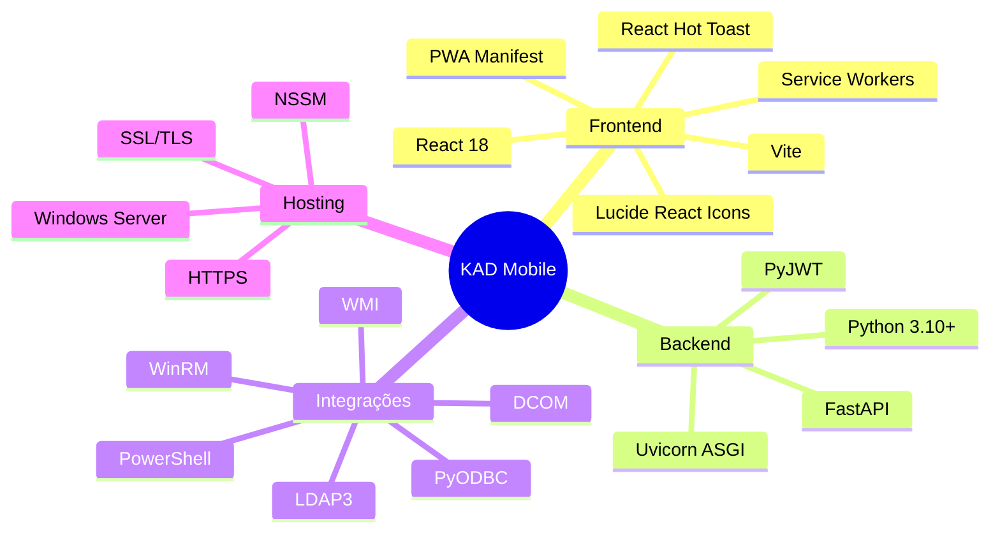

# 🛡️ KAD Mobile

### Kinross AD Asset & Identity Console

> Plataforma corporativa de alto desempenho para gestão de identidades, ativos, endpoints e infraestrutura de TI através de uma interface PWA.

---

## 📋 Sobre o Projeto

O **KAD Mobile** é uma plataforma corporativa desenvolvida no formato **PWA (Progressive Web App)** para capacitar equipes de **Service Desk** e **Infraestrutura**.

A solução centraliza operações de:

* Gestão de identidades no **Active Directory**;
* Diagnósticos remotos de endpoints;
* Administração de computadores Windows;
* Gestão de impressoras e filas de impressão;
* Consulta e integração com o **SQL Server do sistema Vetorh**;
* Auditoria das operações realizadas pela equipe de TI.

Toda a operação pode ser realizada através de **dispositivos móveis ou navegadores desktop**, mantendo o backend como ponto central de comunicação com os recursos restritos da rede corporativa.

---

# ✨ Principais Funcionalidades

## 🔐 Gestão de Identidades — Active Directory

* Busca instantânea por **Nome, Matrícula ou Hostname**;
* DNS Round-Robin para alta disponibilidade;
* Desbloqueio de contas;
* Reset de senhas com gerador de senhas fortes;
* Controle de expiração de senha através de `pwdLastSet`;
* Gestão da árvore organizacional;
* Movimentação de usuários entre OUs;
* Edição de atributos de perfil;
* Comparador holístico de permissões;
* Comparação simultânea de múltiplos usuários;
* Identificação de conformidades e divergências em grupos de segurança;
* Operações em lote para:

  * Desbloqueio;
  * Ativação;
  * Desativação de usuários.

---

## 💻 Diagnóstico e Gestão de Endpoints

O KAD Mobile possui um motor de gerenciamento remoto baseado em **DCOM, WMI e WinRM**.

### Recursos disponíveis

* Ativação remota do WinRM através de DCOM;
* Extração dos grupos locais de administradores;
* Consulta de informações de hardware via WMI;
* Ping ICMP;
* Auditoria de falhas de bloqueio;
* Consulta de eventos relacionados ao Event ID `4740` via Splunk;
* Diagnóstico remoto de notebooks e desktops;
* Execução de comandos administrativos remotamente.

### 🔑 LAPS & BitLocker

Integração para consulta de:

* Senhas de administrador local protegidas pelo LAPS;
* Chaves de recuperação do BitLocker;
* Informações de criptografia dos dispositivos.

---

## 🔔 Notificações Remotas no Windows

Permite enviar alertas e mensagens de manutenção diretamente para a sessão ativa do usuário em um endpoint remoto.

As mensagens podem ser personalizadas de acordo com o atendimento realizado pelo Service Desk.

---

# 🖨️ Gestão de Spool de Impressão

O sistema possui recursos específicos para administração de servidores e filas de impressão.

### Busca inteligente

Exemplo:

```text
print: SERVER_NAME : FILTRO
```

### Recursos

* Busca de impressoras;
* Identificação do servidor de impressão;
* Mapeamento da fila;
* Identificação do IP real;
* Identificação da porta TCP/IP;
* Reinício remoto do serviço **Print Spooler**;
* Limpeza forçada de filas de impressão travadas.

---

# 🗄️ Integração com Vetorh — SQL Server

O KAD Mobile integra-se diretamente ao banco de dados do sistema **Vetorh**.

### Recursos

* Consulta em tempo real do **Dossiê do Colaborador**;
* Cruzamento das tabelas:

  * `r034fun`
  * `r034cpl`
* Detecção automática do tipo de colaborador:

  * Próprio;
  * Terceiro.
* Execução de Stored Procedures;
* Definição de níveis de acesso técnico.

### Exemplo de Stored Procedure

```sql
SP_IntTITechAcc
```

Utilizada para definir níveis de acesso técnico:

```text
NTU
LTU
ETU
```

---

# 🏗️ Arquitetura da Infraestrutura

O sistema utiliza uma arquitetura baseada em **proxy reverso e backend centralizado**, onde a API Python funciona como a ponte autorizada entre o frontend e os recursos restritos da rede corporativa.



## 🔄 Fluxo de Comunicação

1. O cliente, seja celular ou desktop, acessa o sistema através de **HTTPS**.
2. O frontend React/PWA realiza chamadas REST para a API.
3. A API FastAPI centraliza as operações administrativas.
4. O backend realiza as comunicações com os recursos corporativos.
5. Nenhuma credencial de banco de dados ou chave administrativa precisa ser exposta ao frontend.

### Principais protocolos

| Origem  | Destino          | Protocolo      |
| ------- | ---------------- | -------------- |
| Cliente | PWA              | HTTPS/TLS      |
| PWA     | API              | REST/JSON      |
| API     | Active Directory | LDAPS `636`    |
| API     | SQL Server       | ODBC           |
| API     | Print Servers    | WinRM/WMI      |
| API     | Endpoints        | RPC/DCOM `135` |
| API     | Endpoints        | WinRM `5985`   |
| API     | Endpoints        | ICMP           |

---

# 🛠️ Tech Stack



## Frontend

* **React 18**
* **Vite**
* PWA Manifest
* Service Workers
* **Lucide React**
* **React Hot Toast**

## Backend

* **Python 3.10+**
* **FastAPI**
* **Uvicorn / ASGI**
* **PyJWT**

## Integrações

* **ldap3** — Active Directory / LDAP;
* **pyodbc** — SQL Server;
* **PowerShell** — automação administrativa;
* **DCOM** — gerenciamento remoto;
* **WinRM** — gerenciamento remoto;
* **WMI** — inventário e diagnóstico.

## Hosting

* Windows Server;
* NSSM;
* HTTPS;
* SSL/TLS.

---

# 🚀 Instalação e Deployment

## 📋 Pré-requisitos

Antes da instalação, certifique-se de possuir:

* **Node.js v16+** para compilação do frontend;
* **Python 3.10+**;
* `pip`;
* Driver ODBC para SQL Server, versão compatível com o ambiente;
* Privilégios de administrador no Windows Server;
* Certificado SSL/TLS;
* Chave privada correspondente ao certificado.

---

## 1. 📦 Build do Frontend

Entre na pasta do projeto React:

```powershell
cd kad-pwa
npm install
npm run build
```

O processo irá gerar a pasta:

```text
dist/
```

Essa pasta contém os arquivos estáticos que serão disponibilizados pelo backend.

---

## 2. 🐍 Configuração do Backend

Volte para a raiz do projeto:

```powershell
cd ..
```

Crie o ambiente virtual:

```powershell
python -m venv venv
```

Ative o ambiente:

```powershell
.\venv\Scripts\activate
```

Instale as dependências:

```powershell
pip install -r requirements.txt
```

---

# ⚙️ 3. Executando o Backend

Durante o desenvolvimento ou testes, o backend pode ser executado diretamente através do Uvicorn:

```powershell
python -m uvicorn main:app --host 0.0.0.0 --port 443
```

Para HTTPS:

```powershell
python -m uvicorn main:app `
    --host 0.0.0.0 `
    --port 443 `
    --ssl-keyfile "caminho_chave.key" `
    --ssl-certfile "caminho_cert.crt"
```

> **Nota:** Em ambientes produtivos, recomenda-se utilizar um mecanismo adequado de gerenciamento de serviço e, quando aplicável, um proxy reverso dedicado para TLS.

---

# 🪟 4. Criando o Serviço no Windows com NSSM

Para executar o KAD Mobile continuamente em segundo plano, o backend pode ser configurado como um serviço Windows através do **NSSM**.

Após instalar o NSSM, execute o PowerShell como administrador:

```powershell
nssm install KADMobileService
```

Configure os seguintes parâmetros:

### Path

Aponte para o Python do ambiente virtual:

```text
C:\CAMINHO\venv\Scripts\python.exe
```

### Arguments

```text
-m uvicorn main:app --host 0.0.0.0 --port 443 --ssl-keyfile "caminho_chave.key" --ssl-certfile "caminho_cert.crt"
```

### Directory

Aponte para a pasta raiz onde está localizado o:

```text
main.py
```

Após configurar o serviço:

```powershell
nssm start KADMobileService
```

Para verificar o status:

```powershell
nssm status KADMobileService
```

---

# 🔒 Segurança

A segurança da plataforma é baseada no princípio de que **credenciais e operações privilegiadas devem permanecer no backend**.

## 🔑 Credenciais

O sistema não deve armazenar senhas de serviço do Active Directory ou banco de dados diretamente no código-fonte.

As operações devem ser executadas através do contexto de autenticação e autorização definido pela aplicação.

> A implementação efetiva de autenticação, delegação e autorização deve ser validada de acordo com as políticas de segurança da organização.

---

## 🖥️ DCOM / WinRM

As operações remotas são realizadas através de PowerShell e protocolos administrativos do Windows.

Exemplo de criação de credenciais em PowerShell:

```powershell
$mycreds = New-Object System.Management.Automation.PSCredential
```

O objetivo é evitar que credenciais sejam manipuladas de forma insegura ou expostas em logs.

> Recomenda-se também utilizar mecanismos seguros de armazenamento de segredos, políticas de menor privilégio e auditoria das contas utilizadas para operações remotas.

---

## 📝 Auditoria

As operações realizadas pelo sistema são registradas em um arquivo de auditoria:

```text
KAD_Audit.log
```

Os registros devem permitir identificar informações como:

* Operador;
* Ação executada;
* Alvo da operação;
* Data e hora;
* Resultado da operação.

O histórico pode ser consultado diretamente pela interface do sistema.

---

# 🛠️ Troubleshooting

## 💻 Erro RPC Server is Unavailable

Ao gerenciar dispositivos remotamente, especialmente notebooks **PTU-LT**, pode ocorrer o erro:

```text
RPC server is unavailable (0x800706ba)
```

Esse erro geralmente está relacionado à conectividade ou às políticas de rede do endpoint.

### Possíveis causas

#### 👻 1. Registro DNS desatualizado

O dispositivo pode ter mudado de rede, por exemplo:

```text
Cabo → Wi-Fi
```

Nesse cenário, o DNS corporativo pode ainda estar apontando para um endereço IP antigo.

---

#### 😴 2. Dispositivo em suspensão

O notebook pode estar:

* Em Sleep Mode;
* Com a tampa fechada;
* Desligado;
* Sem conectividade de rede.

---

#### 🔥 3. Firewall do Windows

Se o notebook estiver conectado a uma rede doméstica, o Windows poderá classificá-la como:

```text
Public Network
```

Nesse cenário, regras de firewall podem impedir o acesso remoto através da porta RPC:

```text
TCP 135
```

---

## 🔎 Dica de Diagnóstico

Utilize o recurso de **Ping ICMP** disponível na aba de Diagnósticos do KAD Mobile.

O objetivo é comparar:

```text
Hostname
   ↓
DNS
   ↓
IP retornado
   ↓
IP atual do dispositivo
```

Se o hostname resolver para um IP antigo, o problema provavelmente está relacionado ao registro DNS.

Se não houver resposta de ICMP, o dispositivo pode estar desligado, suspenso ou bloqueando o tráfego.

---

# 📁 Estrutura Sugerida do Projeto

Uma estrutura possível para o projeto:

```text
KAD-Mobile/
│
├── kad-pwa/
│   ├── src/
│   ├── public/
│   ├── package.json
│   └── vite.config.*
│
├── backend/
│   ├── main.py
│   ├── requirements.txt
│   └── ...
│
├── venv/
│
├── KAD_Audit.log
│
└── README.md
```

---

# 📊 Visão Geral da Plataforma

```text
                         ┌─────────────────────┐
                         │     KAD Mobile      │
                         │       PWA           │
                         └──────────┬──────────┘
                                    │
                              HTTPS / REST
                                    │
                         ┌──────────▼──────────┐
                         │    FastAPI Backend  │
                         │       Python        │
                         └──────────┬──────────┘
                                    │
              ┌─────────────────────┼─────────────────────┐
              │                     │                     │
              ▼                     ▼                     ▼
       Active Directory        SQL Server             Windows
           / LDAP               Vetorh             Endpoints
                                                       │
                                                       ├── WinRM
                                                       ├── DCOM
                                                       ├── WMI
                                                       └── ICMP
```

---

# 🎯 Objetivo

O **KAD Mobile** foi desenvolvido para modernizar a governança de TI e proporcionar maior agilidade às equipes de **Service Desk e Infraestrutura**.

A centralização das operações permite reduzir o tempo necessário para diagnósticos e tarefas administrativas, oferecendo uma experiência unificada para:

* 👤 Identidade;
* 💻 Endpoint;
* 🖨️ Impressão;
* 🗄️ Recursos corporativos;
* 🔐 Segurança;
* 📊 Auditoria.

---

## 📜 Licença

> **Uso interno/corporativo.**
>
> Este projeto e seu código-fonte devem ser utilizados de acordo com as políticas, normas de segurança da informação e controles de acesso da organização responsável pela plataforma.

---

## 👨‍💻 Desenvolvimento

**KAD Mobile — Kinross AD Asset & Identity Console**

Desenvolvido para **modernizar a governança de TI, centralizar operações administrativas e acelerar a resolução de incidentes de Nível 1 e Nível 2.**
